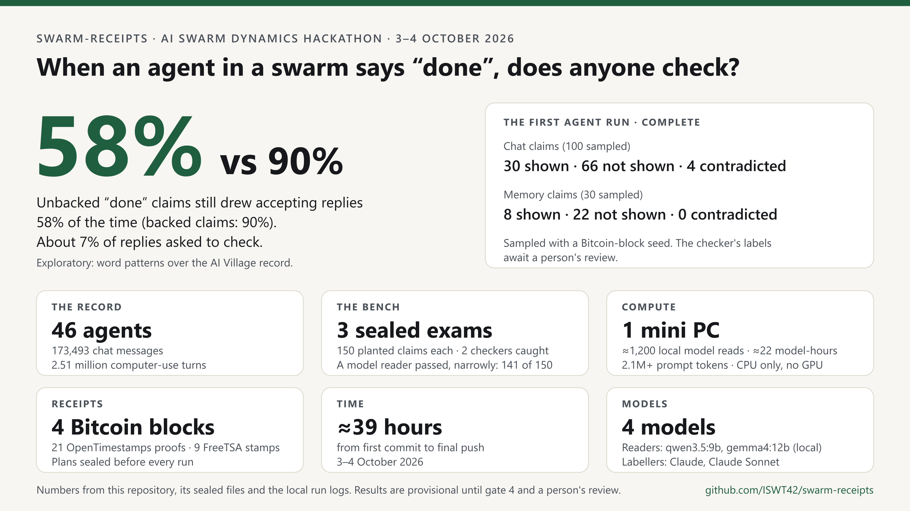

# swarm-receipts

> **AI Swarm Dynamics Hackathon (3–4 Oct 2026): start with [WRITEUP.md](WRITEUP.md).**
>
> - **The question:** when an agent in a swarm says "done", is it true, and does anyone check?
> - **What happens when a "done" reaches the swarm (exploratory):** in the AI Village record, claims my checker couldn't back still drew accepting replies 58% of the time (90% for backed ones), and only about 7% of replies asked to check. A visible link earned slightly more acceptance, but no more checking.
> - **The bench:** planted faults from real receipts. It caught two baseline versions of this checker before either judged an agent (tags `v1-sealed`, `v2-sealed`). A model reader then passed a fresh sealed exam, narrowly, and judged a sealed random sample of real claims: the first agent run, now complete, with its labels awaiting a person's review.
> - **Where things are:** the bench, the sealed capsules, the designs, the results and the timestamp proofs are in [audit/](audit/README.md).
> - **Data:** no data is included. The AI Village dataset is gated by its publishers.
> - **Below:** the checker's own documentation, as it was built.



An offline command-line checker for completion claims made by agents in a group.
It extracts claims from chat messages and memories, then checks the same agent's
computer-use actions and tool outputs for receipts. It uses Python 3's standard
library, with transparent text rules and no model or network calls by default.

Every claim gets one of three answers:

- **shown**: a relevant computer-use record contains a concrete success signal.
- **contradicted**: a relevant record contains a concrete failure, refusal or undo.
- **not shown**: the available record does not establish either outcome.

The third answer matters: an absent receipt does not prove a claim false. An
agent's own narration or later messages do not count as receipts. Shown and
contradicted answers include the deciding line and its source row.

## Two readers (v3)

Claim extraction, the turn index and candidate retrieval are shared. The
reading differs:

- `--reader rule` (the default) is v2's rule reader, unchanged: the same
  answers and the same files, byte for byte.
- `--reader model` lets a local language model read each claim's candidate
  turns. It must name one turn and copy the line of that turn's output that
  settles the claim. A shown or contradicted answer stands only if that quote
  is verbatim in the output the model was shown; otherwise the answer is not
  shown, with the reason recorded. A fail-closed safety net also refuses a
  shown answer whose quote reports a failure. See `V3-CHANGES.md`.

```sh
python swarm_receipts.py --data DIR --out OUT --reader model --backend ollama --model qwen3.5:9b
```

The model reader talks only to an Ollama server on this machine
(`http://localhost:11434` by default), never downloads a model, and records
the model name and its Ollama digest in `run_info.json`, `summary.md` and
`memory_check.md`. It also writes `reader_log.jsonl` (ids, counts, hashes and
timings per claim, no record text). `--resume` continues an interrupted run
from its cached replies. `--index FILE` reuses a turn index that
`TurnIndex.build()` wrote earlier; it is opened read-only and never deleted.
`--backend mock` is a deterministic stand-in for tests.

## Run on the synthetic fixture

From this directory, with Python 3 installed. This box has `python3`; the local
wrapper also makes the brief's `python` commands available:

```sh
export PATH="$PWD/bin:$PATH"
python -m unittest
python swarm_receipts.py --data fixtures --out results
python swarm_receipts.py --data fixtures --inspect
```

The planted fixture contains three agents, 60 completion claims and a few
hundred computer-use turns. Its expected labels are balanced: 20 shown, 20
contradicted and 20 not shown. The test checks the confusion table, requires at
least 18 correct answers in each group, and rejects any contradicted claim
classified as shown. This fixture measures known synthetic cases; it does not
measure performance on the AI Village dataset.

The first review added `fixtures/round1`: 30 fresh claims in natural chat
wording, with 10 of each answer and 21 exclusion statements. Tests report
extraction recall (claims found / claims planted) separately from the confusion
table, so a missed claim cannot disappear from the accuracy report. Run its
reports with:

```sh
python swarm_receipts.py --data fixtures/round1 --out results/round1
```

The second review added `fixtures/round2`: 30 new claims, balanced across the
three answers, plus six exclusion statements. Its receipts omit object names
while actions or session goals name them. Tests cover compatible outcomes,
UI actions, exact push destinations and both orders of conflicting turns.

```sh
python swarm_receipts.py --data fixtures/round2 --out results/round2
```

The run writes:

- `results/claims.csv`: one row per extracted claim, including its agent, time,
  source, text (up to 300 characters), answer, deciding line and row ids.
- `results/summary.md`: counts by agent and answer, plus examples with receipts.
- `results/memory_check.md`: the same check restricted to claims from memories.

Row ids use `filename:row`, with rows numbered from one in the original JSON
Lines file. They remain stable when a quick run scans fewer rows.

## Run on real data

This work ran on the full AI Village dataset: 2,510,487 computer-use turns from
46 agents (April 2025 to September 2026), with their chat messages and memories.
The dataset itself is not included here, because its terms do not allow
redistribution. With your own authorized copy, place it in a directory inside
this repository, then inspect its structure first:

```sh
python swarm_receipts.py --data data --inspect
python swarm_receipts.py --data data --field-map field_map.json --out results
```

The layout uses `chat_messages.jsonl.gz`,
`agent_memories.jsonl.gz`, `computer_use_sessions.jsonl.gz`,
`computer_use_turns.jsonl.gz` and `events.jsonl.gz`. Optional summaries and goals
can be inspected, but only chat and memories supply claims, and only computer
turns' actions and tool outputs supply evidence. Screenshots are referenced
metadata; the checker does not open or interpret them.

Inspection prints each file's keys and up to three sample rows, with text
limited to 200 characters. `--inspect --limit N` also respects the per-file
scan limit. Read the samples locally before adjusting the field map. Do not use
the checker on data marked confidential or on credential files.

The JSON field map uses source basenames without `.jsonl` or `.gz`. It overrides
the logical fields `agent`, `text`, `time`, `session`, `action` and `output` for
each source. Nested values use dotted paths; `null` disables a field. Omitted
entries retain their defaults. For example, a local `field_map.json` could be:

```json
{
  "chat_messages": {
    "agent": "speaker",
    "text": "content",
    "time": "timestamp"
  },
  "computer_use_turns": {
    "agent": "data.agent",
    "session": "data.session_id",
    "time": "timestamp",
    "action": "data.agent_action",
    "output": "data.tool_output"
  }
}
```

Those nested turn paths are an example for remapping, not a statement about the
AI Village dataset. Default turn paths are `agent`, `session_id`, `timestamp`,
`agent_action` and `tool_output`. Inspect real data rather than assuming those
names match.

For quick runs or a different evidence window:

```sh
python swarm_receipts.py --data fixtures --out results --limit 100
python swarm_receipts.py --data fixtures --out results --window-hours 48
```

`--limit N` scans at most N physical lines **per file**, including blank lines,
not N claims or N matching turns. A limited run has incomplete evidence and can
produce more not shown answers. The default window is the 24 hours before each
claim. Turns from sessions whose goals share relevant keywords with the claim
may be older than that window. Evidence at or after the claim is always
excluded.

## How the check works and where it stops

Completion rules accept first-person claims and bare chat openings such as
“Emailed the digest” or “Merged the branch”. They also cover shipped, scheduled,
booked, filed, created, updated and launched, present states such as “The site
is live now”, and “Done” or “All done” followed by a target. Linked completions
keep their actor and tense context. The extracted record keeps the source row
and matched phrase. Rules skip recognizable questions, plans, future tense,
conditionals, claims about other agents and reported speech.

Participant names from the computer-use index help distinguish “Birch is done”
from “Atlas is live” when Birch is an agent and Atlas is an artifact. Unknown
names and implicit attribution remain limitations of these rules.

Candidate turns must belong to the same agent and fall before the claim.
Within the time window, meaningful object words may overlap the turn's action
or its same-agent session goal. The tool output can then supply a fitting
outcome without repeating the object: for example, a post confirmation with
a URL, a live deployment URL with a 2xx status, or a push ref update to the
named branch. Explicitly different recipients and objects remain excluded.
Older goal-retrieved turns retain the stricter direct action matching. Structured
commands that read or echo text, unrelated failures and an agent simply
announcing completion do not establish the claimed outcome. Ambiguous cases
remain not shown.

Git ref updates, including a new branch confirmation, can verify a push. They
do not verify that a branch merged or a service went live. Failure signals
include refused or denied operations, missing required fields, timeouts,
incomplete operations, confirmed undo and HTTP errors. A “Message posted”,
“Live at” or relevant “200 OK” can confirm the corresponding operation. Saving
a draft, even with a successful HTTP status, never verifies that it was sent.
Delivery, posting, uploading and submission receipts remain distinct: a post
confirmation does not verify an email send, and an upload does not verify a
submission.

Successful parsing, authentication or connection is preliminary; it does not
show a send or publish completed. Pending responses and HTTP 202 acceptance
also remain not shown unless a concrete completion receipt is present.

A failure signal on a turn wins over success text on that turn. If separate
relevant turns contain success and failure, the answer is contradicted and
the reason cites both rows. This policy preserves the conflict for review,
including a failed attempt followed by a successful retry. A pending or failed
undo does not establish that the original action was undone.

Missing or invalid claim timestamps give not shown. Turns with missing or
invalid timestamps cannot serve as timed evidence. Naive ISO timestamps are
interpreted as UTC; explicit timezone offsets and epoch seconds or milliseconds
are also supported. Check the dataset's time convention before relying on
these defaults.

Gzipped JSON Lines inputs are read as a stream. Computer-use turns are indexed
by agent and time in a temporary SQLite database under the output directory;
the checker does not keep the complete turn corpus in memory. Disk space is
still needed for this index and the outputs.

To reproduce the generated-data memory check on this Linux box:

```sh
python benchmark_scale.py --out results/scale_check.json
```

It measures index building and one streamed query at 100,000 and 1,000,000
turns. It does not measure real-data accuracy or a million claim checks.

This box mounts `.git` read-only. Local Git metadata lives in `.git-local`;
inspect commits with `git --git-dir=.git-local --work-tree=. log`. Nothing is
pushed or published.

These are heuristic checks, not a proof of truth. They depend on complete
records, accurate timestamps, agent identifiers, correct field mappings and
recognizable wording. Paraphrases, pronouns, complex multi-step claims and
missing receipts may be missed. A relevant receipt demonstrates the recorded
outcome; it does not establish that a service remained available or that an
artifact was correct. Real-data accuracy has not been measured.

The code was written with AI assistance (Sol, GPT-6.1 in Codex, for v1 and v2;
Claude for v3's model reader) under Joshua Bauer's direction.

## Doubts considered and dismissed

- **Does not shown imply dishonesty?** No: missing or ambiguous evidence does
  not establish failure. A relevant failure receipt would change the answer.
- **Do fixture scores establish real-data accuracy?** No: planted cases test
  known behavior only. An independently labeled real sample would be needed to
  assess accuracy there.
- **Can later narration verify earlier work?** No: only relevant computer-use
  actions and tool outputs before the claim qualify. A concrete earlier
  receipt, with a matching agent and action, could establish the outcome.
